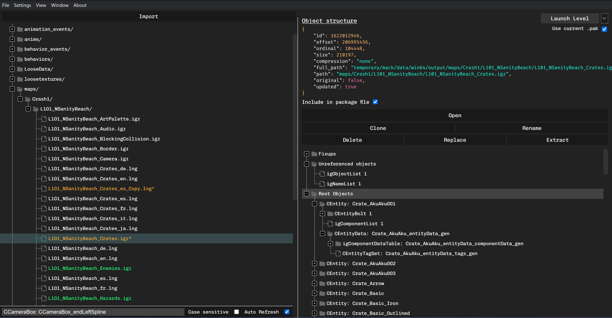
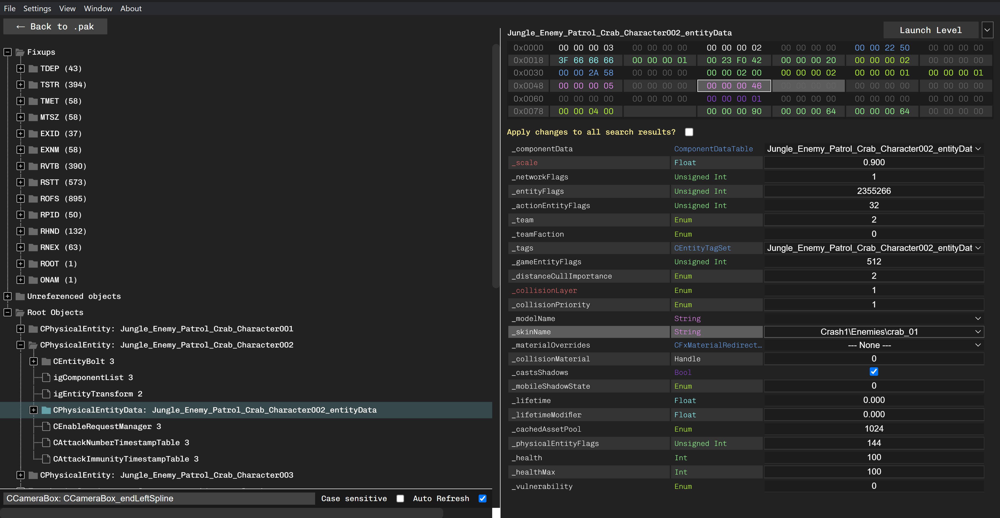

## A work-in-progress tool for modding the Crash NST PC game

This tool lets you explore and edit .pak archives and .igz files for the PC version of Crash NST.

You can edit igz directly from within pak archives and rebuild new archives without having to leave the app.

This is an early demo, bugs may appear. Feedback and contributions are welcome!

You can download it for Windows on [the release page](https://github.com/kishimisu/Crash-NST-Modding-Tool/releases).
For other OS, see below for build instructions.

### PAK explorer

*Allows you to explore .pak archives*



**Important Note**: No change will be applied until a file is saved.
Moreover on the very first time saving a new archive, every file will be decompressed and cached (which can take some time). Subsequent saves should be way faster than the first one.

#### PAK Controls

- **Launch Level**: Run the game at the selected level. If `Use current pak` is checked, the original level archive will be overwritten with the current one.

- **File -> Revert Level**: Revert the original archive (in the game folder) to its default state. Does not reset the content of the current archive being explored.

- **Import**: Import either a single .igz file or a selection of files from another PAK archive into the current one. If `Update package file` is selected, all dependencies will also be imported recursively, and the _pkg.igz file will be rebuilt.

*When clicking on a .igz file within the archive:*

- **Open**: Open the file to access and edit its content.

- **Include in package file**: Whether the file should be loaded by the game or not.

- **Replace**: Replace the content of a file with another one from the current PAK archive.

- **Clone**: Duplicate a file and its content.

- **Extract**: Uncompress & save a file from a PAK archive to the disk.

- **Delete**: Remove a file from the archive.

- **Rename**: Rename a file.

### IGZ explorer

*Allows you to explore .igz files within PAK archives or standalone IGZs*



#### Elements

- **Objects**: List of root objects referenced in the file, with children dependencies.

- **Unreferenced objects**: Contains objects that are not referenced by any other. Usually, it will have two entries that should not be updated (igObjectList & igNameList).

- **Fixups**: Fixups containing list of offsets are directly translated to the object they're pointing to in their child view. Other fixups contains their original data (strings or int list)

### Data editing

The objects in IGZ files are associated with their original metadata, so it's possible to view their name and type as well as edit the corresponding value.

#### Relative calculations

You can do relative computations when editing a number value. For example writing `* 2` will multiply the current value by two.
It also works with `+ 2`, `/ 2` but it needs to be `-= 2` for subtraction to prevent confusing with the negative number `-2`.

#### Multi-editing
If you select an object that is the result of a search query, you will have the possibility to apply your changes to every selected object at the exact same offset.
Relative calculation works with multi-editing and will affect each object's relative to its original value.

#### Interesting properties
When opening a .igz file, every object will be scanned to check for "interesting" properties, ie. properties for which the value can change between objects of the same type within the file. These properties will be colored in red. All properties in white have the same value for all other objects of the same type.

#### Special properties types
`Memory Ref`: If you click on properties of type `Memory Ref` (which contains a list of elements), the cell containing the actual data will be focused. If the data is located in another object, this object will be opened. The same is possible for `Raw Ref` types.

#### Additional infos
Depending on their type, detailed informations are available when hovering the name and type of properties.

#### Copy/Paste (Disabled)
For complex types like Object References, String Reference, Vectors, Arrays or Matrices, you have the possibility to right-click on a field to copy the value to your clipboard. You can also use it to paste data between properties of the same type.

#### Spawn at Vector (Disabled)
Two additional options become available when right-clicking on Vector3f properties:
- Spawn Here : Launches the game while spawning Crash at the selected location, without saving or updating the current archive.
- Spawn on Crate : Same, but it will also spawn a crate at the specified location.

The can help you visualize the position of objects in a level.

### Other infos

**Change the game folder**: You can change the directory of the game in the Settings menu. It should point to the folder containing `CrashBandicootNSaneTrilogy.exe`

**Backup & Restore**: You can choose to backup and restore the game archives folder. Be sure that it is unmodified when first backing it up.

**Change the endianess**: When viewing objects data in an igz, the bytes are displayed in big endian format by default. You can switch to little endian in the `Settings` menu.


## Run the project
You can either [download the latest executable](https://github.com/kishimisu/Crash-NST-Modding-Tool/releases), or build the project yourself using `yarn`:

### Generate platform-specific distributable
```
yarn
yarn make
```

### Develop & contribute
```
yarn
yarn start
```

## Project Structure

### Classes & Objects

- **src/pak**: PAK-related classes
- **src/igz**: IGZ-related classes

### Application

- **src/app/main.js**: Electron setup
- **src/app/renderer.js**: Main app implementation (trees & state for pak & igz views)
- **src/app/object_view.js**: Handles the hex view and list of properties for igObject editing.
- **src/app/field_view.js**: Handle everything related to a property (field)
- **src/app/utils/metadata.js**: Load and convert igObject types metadata from compressed file
- **src/app/import_modal.js**: Import modal for a .pak archive (for "Import" & "Replace" button)

## TODO
- Texture & Audio preview
- Add compressed mode to avoid having to uncompress every file

## Special Thanks
- Crash NST modding Discord: https://discord.gg/4JhhFNWk
- igArchiveLib repo: https://github.com/LG-RZ/igArchiveLib/tree/master
