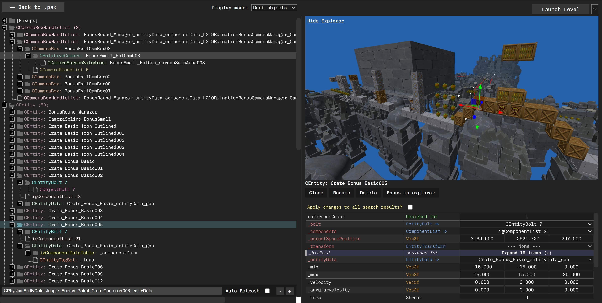

## Modding Tool for Crash NST (PC)


# The development has moved to <br> [https://github.com/kishimisu/Crash-NST-Level-Editor](https://github.com/kishimisu/Crash-NST-Level-Editor) !


---



This tool lets you explore and edit .pak archives and .igz files for the PC version of Crash NST.

Some of the features are listed below.

#### PAK Archives:
- Import .igz files from other archives + automatic dependency import
- Extract, Clone, Replace, Enable/Disable and Delete files from PAK archives
- 3D model preview for actors and models files
- Image preview for texture files
- Explore havok files (.hkx)
- Interactive Level Explorer, with some editing capabilities
- Quickly backup/restore individual levels or the entire game folder

#### IGZ Files:
- Possibility to view and edit all properties for objects in IGZ files
- Clone, Rename, Delete and add collision to objects in IGZ files
- Automatic fixup and reference count update
- Ctrl+L to quickly save + update + launch the game


You can download it for Windows on [the release page](https://github.com/kishimisu/Crash-NST-Modding-Tool/releases).
For other OS, see below for build instructions.

## Table of Contents
[PAK Editor](#pak)  
[IGZ Editor](#igz)  
[Level Explorer](#explorer)  
[Build the project](#run)  

<a name="pak"></a>
## PAK Editor

*Allows you to explore .pak archives*


**Important Note**: No change will be applied until a file is saved.
Moreover on the very first time saving a new archive, every file will be decompressed and cached (which can take some time). Subsequent saves should be way faster than the first one.

#### PAK Controls

- **Launch Level**: Run the game at the selected level. If `Use current pak` is checked, the original level archive will be overwritten with the current one.

- **File -> Revert Level**: Revert the original archive (in the game folder) to its default state. Does not reset the content of the current archive being explored.

- **Import**: Import either a single .igz file or a selection of files from another PAK archive into the current one. If `Update package file` is selected, all dependencies will also be imported recursively, and the _pkg.igz file will be rebuilt.

Note: When importing a .igz file directly (not from an archive), it will be placed under the folder that you currently have selected.

*When clicking on a .igz file within the archive:*

- **Open**: Open the file to access and edit its content.

- **Include in package file**: Whether the file should be loaded by the game or not.

- **Replace**: Replace the content of a file with another one from the current PAK archive.

- **Clone**: Duplicate a file and its content.

- **Extract**: Uncompress & save a file from a PAK archive to the disk.

- **Delete**: Remove a file from the archive.

- **Rename**: Rename a file.

### 3D model viewer

When selecting actors or model files in a .pak archive, a 3D preview of the model will also be displayed.

### Settings menu

- **Change the game folder**: You can change the directory of the game in the Settings menu. It should point to the folder containing `CrashBandicootNSaneTrilogy.exe`

- **Backup & Restore**: You can choose to backup and restore the game archives folder. Be sure that it is unmodified when first backing it up.

- **Change the endianess**: When viewing objects data, the bytes are displayed in big endian format by default. You can switch to little endian in the `Settings` menu.

<a name="igz"></a>
## IGZ Editor

*Allows you to explore and edit .igz files within PAK archives or standalone IGZs*


The objects in IGZ files are associated with their original metadata, so it's possible to view their name and type as well as edit the corresponding value.

### Object display mode
Choose how to display objects in the tree view:
- **Root objects**: Only display root objects (that are not referenced by any other object)
- **All objects**: Display all named objects, grouped by type
- **Alchemist**: Display objects like Alchemist does (less correct)

### Action buttons

- **Clone**: Clone the object and its data (doesn't clone child objects, except for `igComponentList` and `igEntityTransform` as they are required to be cloned too).
- **Delete**: Delete the object and its children recursively. It will only delete objects that are not referenced by any other object.
- **Rename**: Rename an object and update the TSTR fixup
- **Add collisions**: Convert an `igEntity` with static collision to a `CGameEntity` that can be moved around and keep correct collisions.
- **Focus in Explorer**: Open the Level Explorer and focus the selected object in the 3D scene

### Relative calculations

You can do relative computations when editing a number value. For example writing `* 2` will multiply the current value by two.
It also works with `+ 2`, `/ 2` but it needs to be `-= 2` for subtraction to prevent confusing with the negative number `-2`.

### Multi-editing
If you select an object that is the result of a search query, you will have the possibility to apply your changes to every selected object at the exact same offset.
Relative calculation works with multi-editing and will affect each object's relative to its original value.

### Interesting properties
When opening a .igz file, every object will be scanned to check for "interesting" properties, ie. properties for which the value can change between objects of the same type within the file. These properties will be colored in red. All properties in white have the same value for all other objects of the same type.

### Jump to objects (⇒)
- If properties of type `Object Ref` or `Handle` are referencing an object within the current .igz file, you can click on their name to focus/jump to the referenced object.

- Likewise, the references (parents) of objects are listed at the bottom of every object view. You can click on any of their name to focus/jump to the corresponding parent object.

### Automatic reference count update
Each object contains a reference count which needs to be recalculated after updating `igObjectRef` properties to prevent crashes. This is done automatically upon saving an IGZ file.

### Automatic fixup update
When activating/deactivating properties of type `igObjectRef`, `igHandle`, `igString` or `igName`, the corresponding fixups will be updated too.

### Additional infos
Depending on their type, detailed informations are available when hovering the name and type of properties.

<a name="explorer"></a>
## Level Explorer


When loading a pak archive, you have the possibility to open a work-in-progress 3D scene viewer that will scan through all entities of the level files and try to display them using their corresponding model file.

### Controls
If you've ever played Minecraft, it works like Creative Mode.
- W,A,S,D, to move forward/backward and left/right
- Space, Shift to move up/down
- Double press on W to go move faster
- Use the mouse to look around

### Menu Options

- **Open Level Explorer**: (Ctrl+E) Opens the level explorer for the current archive. This will scan for level files (under the maps/ folder) for `igEntites` (white), `CEntities` (green), `CActors` (yellow) and `CGameEntities` (blue). If it's able to find a corresponding model, it will be loaded in the scene, otherwise a sphere will be displayed at its location.
Objects that have collision data are indicated by a small yellow tint, while objects without collision are full white.

- **Show textures**: Whether to load textures for models.

- **Show splines**: Whether to show `igSplineControlPoints` (camera paths, bonus platform paths...)

- **Show entity links**: Whether to show links between `CEntities` and their corresponding spawner.

- **Show grass**: Some levels contain grass, and grass models can take quite some time to extract compared to other models. It's disabled by default for quick load times.

- **Show all objects**: Some objects related to clouds, shadows, leaves, terrain... are not displayed correctly and are hidden by default. You can select this to show them anyway.

- **Render at full resolution**: This option only has effect for retina/2K/4K displays. By default the scene is rendered at a maximum resolution of 1080p for performance. You can choose to display it at native resolution by checking this option.

### Focus in Explorer

When clicking an object in the 3D scene, it will open its parent igz file and set the focus to the corresponding igObject in the IGZ Editor.

Moreover when exploring `Entities` in the IGZ editor, a new button `Focus in explorer` will appear that can take you directly to the object in the level explorer.

### 3D Gizmo Editing

When selecting 3D objects, a gizmo will appear that you can use to move objects around. When doing so, it will actually update the values in the parent file and you can save to apply the changes. However, when manually editing the position of an object in the IGZ editor, the changes won't be applied to the level explorer (not implemented yet).

<a name="run"></a>
## Build the project
You can either [download the latest executable](https://github.com/kishimisu/Crash-NST-Modding-Tool/releases), or build the project yourself using `yarn`:

### Generate platform-specific distributable
```
git clone https://github.com/kishimisu/Crash-NST-Modding-Tool/
cd Crash-NST-Modding-Tool/

yarn
yarn make
```

### Develop & contribute
```
yarn
yarn start
```

## Project Structure

### Classes & Objects

- **src/pak**: PAK-related classes
- **src/igz**: IGZ-related classes
- **src/havok**: Havok-related classes

### Application

- **src/app/main.js**: Electron setup

PAK Editor + main state:
- **src/app/renderer.js**: Main app implementation (trees & state for pak & igz views)
- **src/app/import_modal.js**: Import modal for a .pak archive (for "Import" & "Replace" button)

IGZ/Havok Editor:
- **src/app/object_view.js**: Handles the hex view and list of properties for igObject editing.
- **src/app/field_view.js**: Handle everything related to a property (field)
- **src/app/utils/metadata.js**: Load and convert igObject types metadata from compressed file

Level Explorer:
- **src/app/level_explorer.js**: Manages the Level Explorer

### Utils

- **src/app/utils/model_extract.js**: Extract vertex data from actor/model IGZ files
- **src/app/utils/collisions.js**: Extract collision data from StaticCollision files

## Special Thanks
- Crash NST modding Discord: https://discord.gg/4JhhFNWk
- igArchiveLib: https://github.com/LG-RZ/igArchiveLib/tree/master
- igzModelConverter: https://github.com/AdventureT/IgzModelConverter
- HavokLib: https://github.com/PredatorCZ/HavokLib/
